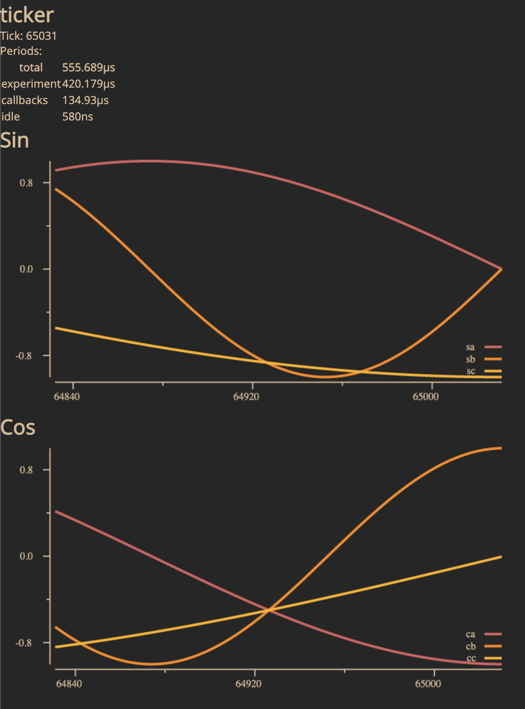

# Multiscope

## Installation

Instructions to install Multiscope from git-on-borg and gerrit.

### Getting the code

Open a terminal on the desktop and navigate to the directory where the
multiscope directory should be created. Clone the git repository:
```
git clone sso://deepmind/multiscope && (cd multiscope && hookdir=`git rev-parse --git-dir`/hooks ;  mkdir -p  $hookdir ; curl -Lo $hookdir/commit-msg https://gerrit-review.googlesource.com/tools/hooks/commit-msg ; ln -s ../../.pre-commit.git $hookdir/pre-commit && chmod +x $hookdir/commit-msg $hookdir/pre-commit)
```

### Getting the Tools for Building and Running

Install the protobuf compiler.

Linux:
```
sudo apt install -y protobuf-compiler
```

Mac OS:
```
brew install protobuf
```

Get the Go plugins for the protobuf compiler and update the PATH so they can be found.

```
go install google.golang.org/protobuf/cmd/protoc-gen-go@v1.28
go install google.golang.org/grpc/cmd/protoc-gen-go-grpc@v1.2
export PATH="$PATH:$(go env GOPATH)/bin"
```

Note that the last line only adds Go to the PATH in the current terminal session. To add it permanently, add the same line to your terminal program's configuration file.

### Compile the web assembly code

```
cd multiscope
go generate generate.go
```

### Example Run

Navigate to one of the examples and run it.

```
cd clients/go/examples/
go run double/double.go --local=false
```

Only use `--local=false` to open the HTTP port to other computers (not safe on a
public network for example).

Open the right port on the desktop in chrome to see the UI of multiscope. It
will look like this:


### Clients

Multiscope provides clients in multiple languages. Current Go, C++ and Python are
under development. See the appropriate directories under `clients/` for more,
language specific details.

## Development

### Pre-commit hook

You will need to install the following executables for the pre-commit hook to
work:
```
go install golang.org/x/tools/cmd/goimports@latest
go install github.com/golangci/golangci-lint/cmd/golangci-lint@v1.46.2
```
You can test the pre-commit hook by running:
```
zsh .pre-commit.git
```
from multiscope top folder.


To push commits to the main repository:
```
git push origin HEAD:refs/for/main
```
### Generating the protocol buffer in Go

Run the following command from the top:
```
go generate protos/generate.go
```

### To modify a commit in the history

From [How do I modify a specific
commit?](https://stackoverflow.com/questions/1186535/how-do-i-modify-a-specific-commit)
on stackoverflow.

1. Rewrite the history with:
```
$ git rebase --interactive 'bbc643cd^'
```
(with `^` at the end)
3. Modify `pick` to `edit` for the `bbc643cd` line. Save and exit the editor.
4. Modify the code, then amend the commit with:
```
git commit --all --amend --no-edit
```
5. Return back to HEAD with:
```
$ git rebase --continue
```
6. Push commits to the main repository (see above).

### Troubleshooting

Encountered problems and their solutions:

1. goimports not found, or "Please install goimports" message: you likely don't have Go in your PATH. See above how to set it.

### Disclaimer

Multiscope is still work in progress and is not an official Google or DeepMind
product (experimental or otherwise), it is just code that happens to be owned by
Google DeepMind.
